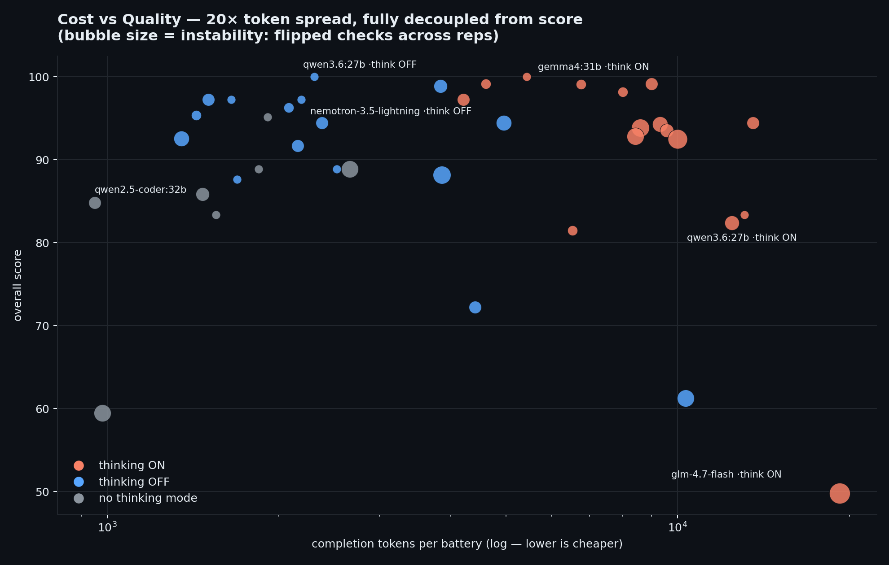

# Invarail

**The authority plane for local AI agents — freedom below, governance above.**

[](https://github.com/PeterGreenAppliedAI/Invarail/actions/workflows/ci.yml)


[](LICENSE)


*(Formerly LocalClaw. The name is invariant + rail: authority that cannot move, structure that exists so things move fast.)*

Invarail runs entirely on your own hardware: no cloud APIs, no per-token costs, no data leaving your machines. It is a **systems answer** to the agent problem, deliberately separated into layers:

- **An authority plane** — permissions, target-bound grants, a confirmation ledger, audit trails, and tool exposure the agent *cannot modify from inside*. Learning may inform execution; it may never expand authority.
- **A daily driver** — chat with graph memory, verified research reports, briefings, scheduling, image generation — on Discord/Telegram/Gmail/web/Chrome through pluggable adapters (Slack/WhatsApp/iMessage/MS Graph adapters were deliberately removed — see DECISIONS).
- **A host for interchangeable workers** — coding runs through the [Pi](https://pi.dev) agent, repeatable procedures through [FlowMCP](https://github.com/PeterGreenAppliedAI/FlowMCP) flows, open-ended tasks through a governed ReAct loop. Workers have been swapped whole (OpenCode out, Pi in) without the architecture noticing.

Built for small local models (7-30B), where every failure is legible the same evening — which is exactly how this architecture was learned.

## At a Glance

An agent that runs on your own GPUs, built so that a **9B model** can drive it — and every claim below is a published, reproducible eval in [`evals/`](evals/).

| What was measured | Result |
|---|---|
| A 9B model through the real front door — router, specialists, six security layers, pipelines — on the config the setup wizard writes | **qwen3.5:9b 36/36** task-reps over 3 runs; gemma4:12b 36/36; qwen2.5:7b 30/36 ([e2e](evals/2026-09-e2e/)) |
| Requests that need two specialists' tools — where a small model's routing mistake used to become a half-done job | **18/30 → 30/30** after routing descriptions that say what each specialist *cannot* do, plus a code-detected reroute ([routing](evals/2026-09-e2e/routing/)) |
| The engine, 41 model × thinking-mode configurations, deterministic checks, 3 reps | Four at 100%; one model swings **82% → 100%** on a single thinking flag — there are no universal settings, only measured ones ([model eval](evals/2026-08-local-model-eval/)) |
| Research reports that check their own claims | Every claim tested against the pages it came from; high-impact ones cross-checked with an independent search; a correction needs evidence that names the claim's own subject ([how](docs/ARCHITECTURE.md#research-claim-verification)) |
| The codebase | **1,234 tests**, CI on Linux and Windows, an end-to-end harness whose `--selftest` proves every scoring check on a scripted perfect run before any model is graded |



*Cost vs quality across the engine eval: a 24× spread in tokens per battery, fully decoupled from score. Thinking on (red) costs several times the tokens; whether it buys anything depends on the model — which is why it is set per model, from measurement.*

## Quick Start

```bash
git clone https://github.com/PeterGreenAppliedAI/Invarail.git
cd Invarail
npm install
npm run setup      # looks at your machine first, then asks only what is yours
npm run doctor     # every dependency your config enables — found or missing, with the fix
npm start          # runs the doctor quietly, builds the console once, boots
```

**The wizard detects before it asks.** It probes Node, Ollama and the models on it, Docker, FalkorDB, SearXNG, LibreOffice, Python with matplotlib and pandas, Obsidian, and any running voice servers, and prints what it found. Then the questions that are actually yours: which model (ranked by the published evals and by what fits your GPU; an empty Ollama gets an offer to pull one; a ≤14B pick gets `promptProfile: "small"`), how it should remember (graph with FalkorDB, flat files, or your Obsidian vault — with or without an embedding model), which channels, and whether the console should be reachable from other devices. Voice is never asked: if a Kokoro (TTS) or faster-whisper (STT) server is running it is used, otherwise voice is off. Say yes to that and it generates the bearer token into `.env` and binds the network; say no and it binds loopback. Sidecars it can run for you (graph memory, search) are offered with a default of yes; system software (Docker, LibreOffice, Python) is named with the install command for your OS and never installed behind your back.

**Tier 0 is fifteen minutes:** Node 22+, Ollama with one model, the web console. Everything above it is one config block and degrades gracefully when absent — [INSTALL.md](INSTALL.md) has the ladder. `npm run doctor` re-checks the machine against your config any time; `npm start` refuses only when boot would be pointless (no config, no Ollama).

**Search has a reputation cost.** Hosted providers (Brave, Perplexity, Grok, Tavily) spend *their* reputation and rate-limit you honestly. Self-hosted **SearXNG** spends *yours*: every query fans out to the engines from your IP, and agents search in bursts. The wizard offers it behind an explicit warning, ships a suggested `searxng/settings.yml`, paces outbound calls, and writes a daily query ceiling — read [SEARXNG.md](docs/SEARXNG.md) before choosing it.

**Where it runs:** macOS and Linux from source; Windows passes the same test suite, the front-door selftest and the wizard smokes in CI on every push, but is not yet a supported install ([INSTALL.md](INSTALL.md)). Posture: one owner on a LAN with the web token is the supported shape; multi-user and internet-facing are not claims this project makes ([SECURITY.md](SECURITY.md)).

**Before exposing anything beyond this machine:** the wizard's generated token is the wall for the console (the adapter refuses a network bind without one). For chat channels, set `ownerId` and per-channel `trustedUsers`, `ownerOnlyTools`, and `confirmTools` — `ownerOnlyTools` is a code gate; those tools do not exist in the model's world for anyone else.

## The Doctrine: Constrain the Arena, Not Every Move

Two agent patterns both work, and Invarail runs both on purpose:

1. **Reduce the decision surface before the model sees it.** A router classifies intent; a specialist gets only the tools its category needs; deterministic pipelines own the workflow and the model only extracts parameters or synthesizes text. Correct for **known procedures** — a weekly research report should never pay a model to rediscover "collect N sources, validate claims, stop."
2. **Give the model a tiny set of general primitives inside a bounded space, and let it compose freely.** The Pi coding worker gets read/edit/write/bash — bash is a meta-tool — scoped to one directory, with acceptance criteria. Correct for **open problems**, where the procedure isn't known until the worker finds it.

The synthesis: define the arena — scope, authority, capability set, evidence required for success — then let the worker work. **Execution freedom is not authority freedom.** A worker may write 200 lines of helper code and retry twenty times; Invarail still decides which paths are writable, whether the network is reachable, which actions require confirmation, and what evidence makes the result count.

```
                     Invarail
                        │
              classify + authorize
                        │
         ┌──────────────┴──────────────┐
         │                             │
  known procedure                unknown / open task
         │                             │
         ▼                             ▼
  deterministic pipeline          bounded worker (Pi)
  known stop rules                small tool surface,
  validation stages               freedom inside the arena
         │                             │
         └──────────────┬──────────────┘
                        ▼
              external validation
                        ▼
              memory / outcomes / audit
```

## Why This Exists

Frontier-model agent frameworks assume a model that reliably handles 15+ tools, complex system prompts, and strict JSON. Local 7-30B models don't. They **narrate** tool calls instead of executing them, **hallucinate** tool names when given too many options, **burn budgets** on thinking and return empty completions, and **fail** complex schemas.

Invarail's response is structural, not prompt-hopeful:

- **Router + Specialist** — a fast model (phi4 today; a 421M System-One encoder in shadow) classifies intent into one category; each specialist sees only its tools. No 80-tool menus. Category descriptions say what each specialist *cannot* do, and a specialist whose answer claims or announces an action it holds no tool for gets one re-dispatch through the full security path (`router.reroute`, default on — DECISIONS 2026-09-29).
- **Pipelines only where stages verify** — `research` and the heartbeat run typed stage sequences where code decides "what step next," with grammar-constrained extraction, JSON repair, and per-stage degrade-not-abort fallbacks. Everything else runs in the arena: an open ReAct loop inside the same walls (DECISIONS 2026-08-21 — the duel showed choreography cost 4.7× for the same result).
- **Everything measured** — a [published 41-row engine-in-the-loop model eval](evals/2026-08-local-model-eval/) drives model/config choices. The same model swung 82%→100% on one thinking flag; there are no universal settings, only measured ones. A [front-door e2e eval](evals/2026-09-e2e/) then runs the small tier through the real router, specialists, stores and pipelines on a wizard-generated config (`scripts/e2e-eval.ts`; its `--selftest` runs in CI).
- **Code gates, never model judgment** — every security boundary is enforced in code before any model is involved.

## How It Is Built

Each of these has a full section in the docs; the README keeps the one-paragraph version.

**The authority plane.** Six layered filters in `src/dispatch.ts` run before any model sees a tool — channel categories, owner-only tools stripped from the model's vocabulary, blocked and restricted tools, and confirm-gated tools backed by a pending-action ledger that executes the *stored* call. Above the filters: a one-bit autonomy ladder (a tool either asks first — `requiresConfirm` — or it doesn't, and channels can promote it), target-bound standing grants (`always <id>` promotes one tool→target pair, never the tool), and sandboxing for exec and every fetcher. The invariant, pinned by tests: experience informs execution; it never expands authority. → [ARCHITECTURE.md: Security](docs/ARCHITECTURE.md#security--the-authority-plane-6-layers-in-dispatch)

**Workers.** Coding runs through the [Pi](https://pi.dev) agent behind one adapter, in a cwd-scoped arena, validated by real test outcomes and observed via lifecycle events. Repeatable procedures are [FlowMCP](https://github.com/PeterGreenAppliedAI/FlowMCP) flows served over the MCP bridge, which does the accommodation small models need (curated descriptions, schema-filtered params, result budgets, confirm gating). Open-ended work runs in a governed ReAct loop whose guardrails were learned from measured failure modes. → [ARCHITECTURE.md: Workers](docs/ARCHITECTURE.md#workers--pi-flowmcp-mcp-react)

**Memory.** A FalkorDB graph (native HNSW vectors) with typed entities, `SUPERSEDES` edges instead of overwrites, provenance on every fact (`stated | observed | inferred` — only a human-reviewed `!save` claims `stated`), a relevance floor on injection, continuous intake every 8 turns, and `USER.md` as a rule rather than an observation. The graph is one tier of four (`memory.backend`: graph, flat, vault — your Obsidian folder, optionally as an Open Knowledge Format bundle — or the legacy auto-detect), and `embeddingModel: "none"` runs memory with no embedder at all. → [MEMORY-SYSTEM.md](docs/MEMORY-SYSTEM.md)

**Research, verified.** The `research` pipeline gathers local-first (a personal web index before any SERP), decomposes into facets, drafts an analytical report, then checks its own claims against the cached pages that mention them and cross-checks the high-impact ones with one independent search each. Corrections are code-spliced sentences; zero sources aborts rather than answers from memory; rendering is deterministic (markdown in, LibreOffice PDF out, `verification.json` alongside). → [ARCHITECTURE.md: Research](docs/ARCHITECTURE.md#research-claim-verification)

**Models.** One principle, measured five swaps deep: the harness holds the value, not the weights. The foreground model is one config line (`defaultModel`). The reference build spreads the work across a home lab — qwen3.8:27B foreground on a 24GB card, phi4 routing and extraction on a 12GB card, the embedder alone on a Mac mini, coding on a separate inference box, and a 421M Laya encoder shadowing the router (logged, never deciding) — but none of that is required: the wizard writes a one-model install for whatever GPU you have. Thinking is a per-stage property, not a per-model one. On one small box, qwen3.5:9b (thinking off) is the recommended foreground — 36/36 on the three-rep front-door battery, gemma4:12b 36/36, qwen2.5:7b a workable 8GB fallback at 30/36 ([evals/2026-09-e2e](evals/2026-09-e2e/)). → [ARCHITECTURE.md: Multi-Model Strategy](docs/ARCHITECTURE.md#multi-model-strategy-three-backend-kinds) · [ROUTING.md: Shadow Router](docs/ROUTING.md#layer-4b-shadow-router-observation-only-2026-09-25)

**Capabilities, channels, console.** Web search and research, memory, Gmail/Calendar (read-only, owner-only), sandboxed execution and code sessions, cron, a task board, cross-channel messaging, a dual-mode browser, vision, voice (Kokoro TTS + Whisper STT — on when a server is detected, off otherwise; the reference build serves both via mlx-audio), documents, image generation, Pi builds, the MCP bridge, standing grants, heartbeat and briefings, knowledge import, and a Chrome side panel — on Discord, Telegram, Gmail, the web API, and a management console with voice mode. → [FEATURES.md: Capabilities at a Glance](docs/FEATURES.md#capabilities-at-a-glance)

**Autonomy that reports for duty.** A 2-hourly heartbeat does deterministic maintenance and proposes; 3× daily briefings reason over calendar, tasks and memory; cron jobs run as continuable, artifact-capturing sessions with owner-authored identity as the code gate. → [FEATURES.md: Autonomy](docs/FEATURES.md#autonomy-that-reports-for-duty)

## Documentation

The README is the front door; the detail lives in dedicated docs:

- **[FEATURES.md](docs/FEATURES.md)** — the capabilities table, channels + console, and feature guides: console + API reference, voice setup, vision, documents, task board, heartbeat/briefing, email steward, multi-step arena tasks, compaction, workspace, CLI, self-improvement (SIP), router training data
- **[INSTALL.md](INSTALL.md)** — the install tier ladder, from Tier 0 to the full build
- **[ARCHITECTURE.md](docs/ARCHITECTURE.md)** — how the engine works
- **[MEMORY-SYSTEM.md](docs/MEMORY-SYSTEM.md)** — the graph memory deep-dive
- **[ROUTING.md](docs/ROUTING.md)** · **[SPECIALISTS.md](docs/SPECIALISTS.md)** — classification and specialist reference
- **[DECISIONS.md](DECISIONS.md)** — decision history, failed experiments included
- **[CLAUDE.md](CLAUDE.md)** — AI-assisted development patterns and the review rubric
- **[SECURITY.md](SECURITY.md)** · **[SEARXNG.md](docs/SEARXNG.md)** — the security posture, and what self-hosted search costs you
- **[ROADMAP.md](ROADMAP.md)** — completed, next up, known issues
- **[docs/history/](docs/history/)** — point-in-time records: a model-handoff brief, the August synthesis brief, the retired gateway's requirements

## Repository Map

```
src/
  dispatch.ts          # router → pipeline/specialist + the six security layers
  router/              # classification: pre-model overrides → model → keyword fallback; shadow router (System-One, observation only)
  pipeline/            # deterministic stage engine + per-category definitions
  tool-loop/           # governed ReAct engine (guardrails, drift/hallucination repair)
  coding/              # Pi SDK adapter — the coding substrate boundary
  tools/               # ~45 tool implementations behind one interface
  mcp/                 # MCP bridge: stdio/HTTP clients, local OAuth, curation layer
  memory/              # FalkorDB graph store, fact store, embeddings, consolidation
  learnings/           # error store, lessons, experience harvesting (code-detected only)
  security/            # pending-action ledger, standing grants
  channels/            # adapters: Discord/Telegram/Gmail/Web (+ Chrome extension bridge)
  console/             # management console API
  exec/                # Docker sandbox + persistent code sessions
  agents/ identity/     # workspace scoping + principals (who a sender is, across channels)
  knowledge/ webindex/  # knowledge import store; personal vertical index (RSS-first honest crawler)
  plugins/ setup/ cli/  # plugin loader; the setup wizard; terminal client
  cron/ tasks/ sessions/ services/ context/ config/ temporal/ browser/
console/               # React management console
chrome-extension/      # WXT + React side panel companion
docs/                  # architecture, routing, specialists, memory, features, SearXNG; docs/history/ for dated records
evals/                 # published model evals + duel artifacts
scripts/               # e2e front-door harness (scripts/e2e/), live checks, Node supervisor, vault→OKF converter (`npm run vault:okf`)
test/                  # 1234 tests across 143 files
```

Architecture deep-dives: [ARCHITECTURE.md](docs/ARCHITECTURE.md) · [ROUTING.md](docs/ROUTING.md) · [SPECIALISTS.md](docs/SPECIALISTS.md) · [MEMORY-SYSTEM.md](docs/MEMORY-SYSTEM.md) · decision history with failed experiments: [DECISIONS.md](DECISIONS.md).

## Extending

**New tool:** implement `InvarailTool` in `src/tools/`, register in `register-all.ts`, add to a specialist's `tools` array. Tools declare structured parameters, whether they ask before acting (`requiresConfirm`), and WHEN TO USE / DO NOT descriptions.

**New channel:** implement the 5-method `ChannelAdapter`, register, add config.

**New MCP server:**

```json5
tools: { mcp: { servers: [{
  name: "flows",
  command: "npx", args: ["tsx", "/path/to/server.ts"],
  cwd: "/path/to/server-repo",          // servers resolving their own paths need their root
  maxResultChars: 14000,                 // raise for gathering tools
  toolDescriptions: { my_tool: "my_tool — WHEN TO USE: ..." },
}]}}
```

Then `"mcp:flows"` in a specialist's tools array exposes the whole server.

**AI-assisted development:** `CLAUDE.md` carries the full pattern/anti-pattern set (error factory, Zod-derived types, ESM, security gates, the 9-gate review rubric) — AI tools that read it generate code that lands in the right place, correctly.

## Safety Summary

Exec allowlist or Docker sandbox (and no exec at all when the requested sandbox is missing) · SSRF protection on all fetchers · symlink-aware path containment on writes and file serving · cross-site writes refused by Origin · per-user rate limiting · cron write-stripping + owner-authored identity · confirmation ledger with sender-bound single-use actions · target-bound revocable grants · owner-only code gate · per-channel category/tool/trust filtering · bearer-token web auth (the token is the owner's credential; a client-sent sender id only partitions sessions) · code sessions inside the Docker sandbox, failing closed · TLS verification on by default · atomic writes (tmp + rename).

## Attribution

Several architectural patterns were adapted from open source agent frameworks:

| Project | What We Adapted |
|---------|----------------|
| **[Hermes Agent](https://github.com/nousresearch/hermes-agent)** (NousResearch) | Structured context compression (Goal/Progress/Next Steps), frozen memory snapshots, character-bounded memory, smart model routing, tool-pair sanitization, CLI inspiration |
| **[Deep Agents](https://github.com/langchain-ai/deepagents)** (LangChain) | Progressive disclosure (compact index, read on demand), subagent context isolation, tool argument truncation in older messages |
| **[agent-reasoning](https://github.com/jasperan/agent-reasoning)** (jasperan) | Self-reflection stage for the plan pipeline (draft → critique → improve) — the plan pipeline was retired for dispatch 2026-08-21; the pattern survives in research's verification stages |
| **[Goose](https://github.com/aaif-goose/goose)** (AAIF/Block) | Tool-specific error recovery (errors as actionable prompts), structured sub-dispatch results, LLM-based observation summarization |

Those frameworks assume frontier models drive the agent. Invarail's contribution is making the patterns hold when a local 27B is driving — pipelines control flow where stages can verify, the arena runs the rest inside code-owned walls, and the model does only the parts that require judgment.

Coding substrate: **[Pi](https://pi.dev)** by Earendil Works (MIT, embedded via SDK).

## Roadmap

Live in [ROADMAP.md](ROADMAP.md) — completed, next up, backlog, known issues. Current focus: the shadow router's real-traffic verdict (and a v4 fine-tune with conversational state before any switch), the memory synthesis pass, and extending the self-modification rail beyond this repo.

## License

MIT
