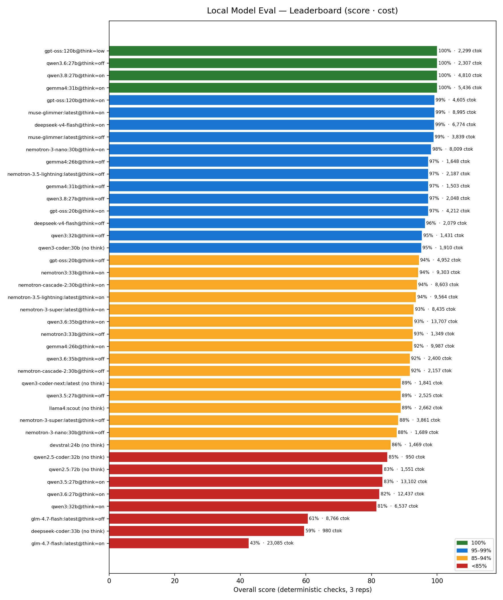
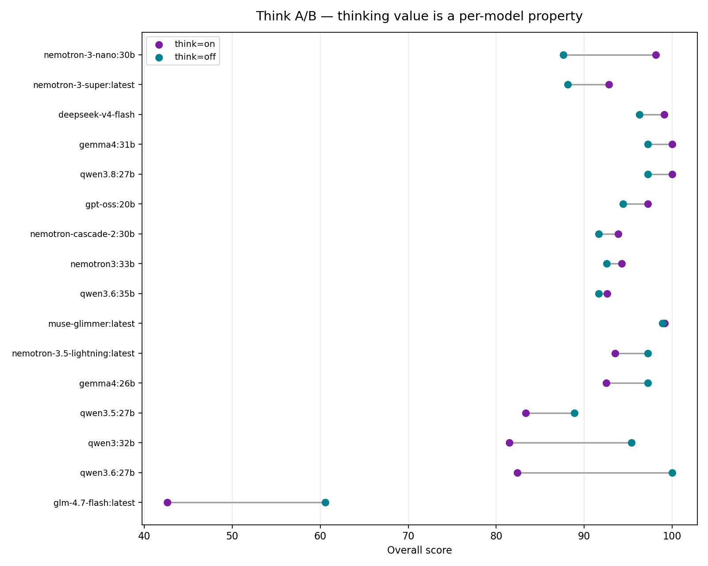
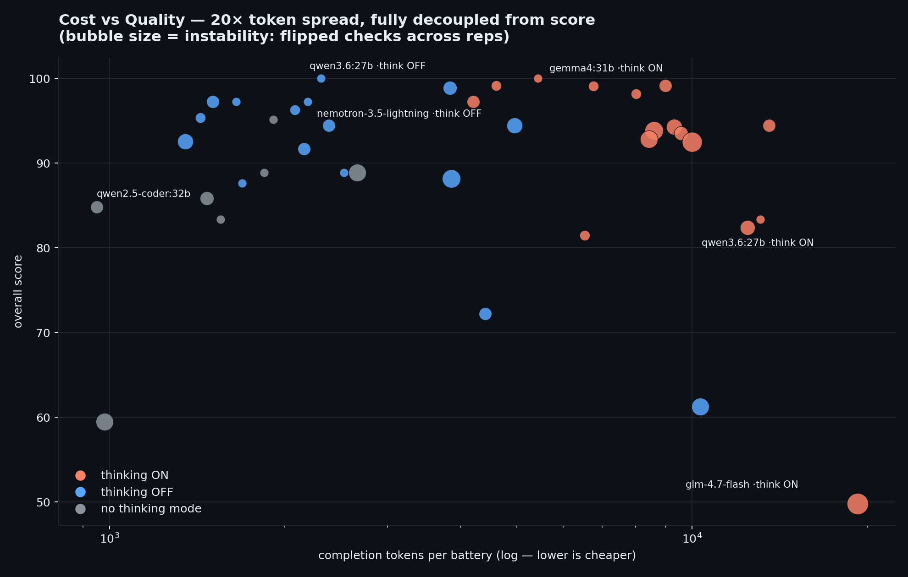

# The Local Model Eval That Kept Finding Our Bugs Instead

**39 scorecard rows · 23 base models (20–124B) · thinking on/off/low A/B · 14 tasks × 3 repetitions · deterministic code checks only**

An engine-in-the-loop evaluation of every local model on our cluster, run through the
*production* harness of [Invarail/LocalClaw](../../) — the real ReAct engine, the real
grammar-constrained extraction pipeline, the real instruction rules, and a Docker
sandbox that executes the code the models write. Not a model-in-isolation benchmark:
a measurement of what these models do inside a working agent system.

It began as "is Meta's new 28B any good?" It ended with five of our own theories
disproven, six bugs fixed across two codebases, and a podium of three perfect
scorecards achieved with three *different* thinking configurations — none of them
the default. The #1 row belongs to a model its owner had written off as unusable:
it needed permission to think *less*, and until this week no layer of the stack
could even deliver that request.

> **TL;DR:** The second-most important spec of a local model is its default
> configuration. Thinking models rarely fail at tasks — they fail at *budgets*
> (timeouts, token caps, format contracts), and production is made of budgets.

---

## Final Board

Sorted by overall score, then cost. `flips` = checks that changed pass/fail between
repetitions (stability). `ctok` = mean completion tokens to finish the full battery —
a **hardware-independent cost metric**. `tok/s` is serving-stack-specific (see
[Provenance](#provenance)) and does not transfer.

| # | Row | Overall | Tool | Extract | Chat | Code | Flips | ctok | tok/s* |
|---|---|---|---|---|---|---|---|---|---|
| 1 | gpt-oss:120b@think=low | **100%** | 100% | 100% | 100% | 100% | 0 | 2,299 | 41.6 |
| 2 | qwen3.6:27b@think=off | **100%** | 100% | 100% | 100% | 100% | 0 | 2,307 | 12 |
| 3 | qwen3.8:27b@think=on | **100%** | 100% | 100% | 100% | 100% | 0 | 4,810 | 19.3 |
| 4 | gemma4:31b@think=on | **100%** | 100% | 100% | 100% | 100% | 0 | 5,436 | 10.4 |
| 5 | gpt-oss:120b@think=on | **99%** | 97% | 100% | 100% | 100% | 1 | 4,605 | 41.1 |
| 6 | muse-glimmer:latest@think=on | **99%** | 97% | 100% | 100% | 100% | 3 | 8,995 | 12.1 |
| 7 | deepseek-v4-flash@think=on | **99%** | 100% | 100% | 96% | 100% | 1 | 6,774 | 20.2 |
| 8 | muse-glimmer:latest@think=off | **99%** | 96% | 100% | 100% | 100% | 4 | 3,839 | 12 |
| 9 | nemotron-3-nano:30b@think=on | **98%** | 100% | 100% | 93% | 100% | 1 | 8,009 | 74 |
| 10 | gemma4:26b@think=off | **97%** | 100% | 100% | 89% | 100% | 0 | 1,648 | 59.3 |
| 11 | nemotron-3.5-lightning:latest@think=off | **97%** | 100% | 100% | 89% | 100% | 0 | 2,187 | 55.8 |
| 12 | gemma4:31b@think=off | **97%** | 100% | 100% | 100% | 89% | 3 | 1,503 | 10.1 |
| 13 | qwen3.8:27b@think=off | **97%** | 100% | 100% | 100% | 89% | 3 | 2,048 | 17.6 |
| 14 | gpt-oss:20b@think=on | **97%** | 100% | 100% | 100% | 89% | 3 | 4,212 | 109.8 |
| 15 | deepseek-v4-flash@think=off | **96%** | 100% | 100% | 85% | 100% | 1 | 2,079 | 21.5 |
| 16 | qwen3:32b@think=off | **95%** | 100% | 100% | 81% | 100% | 1 | 1,431 | 10 |
| 17 | qwen3-coder:30b (no think) | **95%** | 100% | 92% | 89% | 100% | 0 | 1,910 | 85.1 |
| 18 | gpt-oss:20b@think=off | **94%** | 100% | 100% | 100% | 78% | 6 | 4,952 | 32.1 |
| 19 | nemotron3:33b@think=on | **94%** | 96% | 100% | 93% | 89% | 6 | 9,303 | 70.8 |
| 20 | nemotron-cascade-2:30b@think=on | **94%** | 97% | 97% | 93% | 89% | 9 | 8,603 | 73.2 |
| 21 | nemotron-3.5-lightning:latest@think=on | **94%** | 100% | 100% | 96% | 78% | 4 | 9,564 | 65.2 |
| 22 | nemotron-3-super:latest@think=on | **93%** | 100% | 97% | 96% | 78% | 8 | 8,435 | 21.2 |
| 23 | qwen3.6:35b@think=on | **93%** | 100% | 100% | 93% | 78% | 5 | 13,707 | 69.9 |
| 24 | nemotron3:33b@think=off | **93%** | 89% | 100% | 93% | 89% | 6 | 1,349 | 69.8 |
| 25 | gemma4:26b@think=on | **92%** | 92% | 100% | 89% | 89% | 11 | 9,987 | 62.3 |
| 26 | qwen3.6:35b@think=off | **92%** | 100% | 100% | 100% | 67% | 0 | 2,400 | 68.3 |
| 27 | nemotron-cascade-2:30b@think=off | **92%** | 100% | 100% | 89% | 78% | 3 | 2,157 | 71.7 |
| 28 | qwen3-coder-next:latest (no think) | **89%** | 100% | 100% | 89% | 67% | 0 | 1,841 | 58.5 |
| 29 | qwen3.5:27b@think=off | **89%** | 100% | 100% | 89% | 67% | 0 | 2,525 | 12 |
| 30 | llama4:scout (no think) | **89%** | 86% | 92% | 100% | 78% | 8 | 2,662 | 18.3 |
| 31 | nemotron-3-super:latest@think=off | **88%** | 93% | 100% | 70% | 89% | 9 | 3,861 | 21.1 |
| 32 | nemotron-3-nano:30b@think=off | **88%** | 95% | 100% | 89% | 67% | 0 | 1,689 | 72.8 |
| 33 | devstral:24b (no think) | **86%** | 99% | 100% | 100% | 44% | 4 | 1,469 | 13.8 |
| 34 | qwen2.5-coder:32b (no think) | **85%** | 50% | 100% | 100% | 89% | 3 | 950 | 3.2 |
| 35 | qwen2.5:72b (no think) | **83%** | 100% | 100% | 100% | 33% | 0 | 1,551 | 4.4 |
| 36 | qwen3.5:27b@think=on | **83%** | 100% | 67% | 100% | 67% | 0 | 13,102 | 12.1 |
| 37 | qwen3.6:27b@think=on | **82%** | 100% | 67% | 85% | 78% | 5 | 12,437 | 12.1 |
| 38 | qwen3:32b@think=on | **81%** | 100% | 100% | 93% | 33% | 1 | 6,537 | 10 |
| 39 | glm-4.7-flash:latest@think=off | **61%** | 87% | 89% | 67% | 0% | 8 | 8,766 | 61.7 |
| 40 | deepseek-coder:33b (no think) | **59%** | 0% | 97% | 74% | 67% | 8 | 980 | 4.3 |
| 41 | glm-4.7-flash:latest@think=on | **43%** | 83% | 39% | 48% | 0% | 18 | 23,085 | 62.5 |
